# Frist-imgui-glfw3

## 使用言語, ツール
C++, GLSL, opengl  
Visual Studio 2019, VS Code


## 使用ライブラリ
GLFW3 : [https://www.glfw.org/](https://www.glfw.org/)  
glad : [https://glad.dav1d.de/](https://glad.dav1d.de/)  
glm : [https://github.com/g-truc/glm](https://github.com/g-truc/glm)  
std_image : [https://github.com/nothings/stb](https://github.com/nothings/stb)  
imgui : [https://github.com/ocornut/imgui](https://github.com/ocornut/imgui/)  
assimp : [https://github.com/assimp/assimp](https://github.com/assimp/assimp)  

## 制作期間
2021-01 ~ 未定

## 開発人数
個人制作

## 製作者
イゴンヒ

## 参考サイト
Learn OpenGL : [https://learnopengl.com/](https:/learnopengl.com/)

## 動画(YouTube)
[https://www.youtube.com/watch?v=h1-rcwjNfMk](https://www.youtube.com/watch?v=h1-rcwjNfMk)

## GitHub URL
[https://github.com/congibab/Frist-imgui-glfw3](https://github.com/congibab/Frist-imgui-glfw3)

## 目標
1. Gemotry Shader学習
2. imGUIライブラリ学習
3. 3Dモデルにライトを応用してToon Shader実装

<div style="page-break-before:always"></div> 

# プログラム画面
<p align= "center"> 
   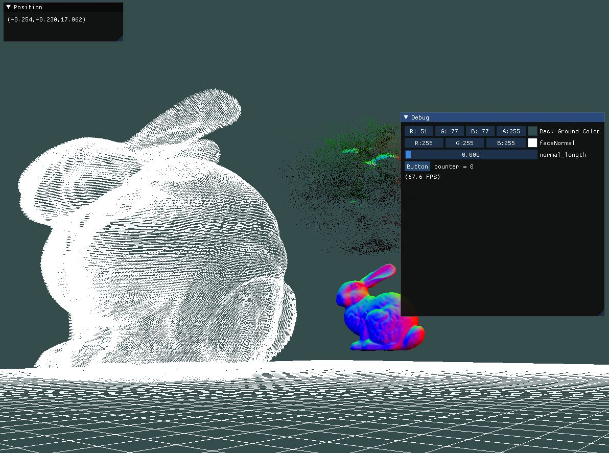
   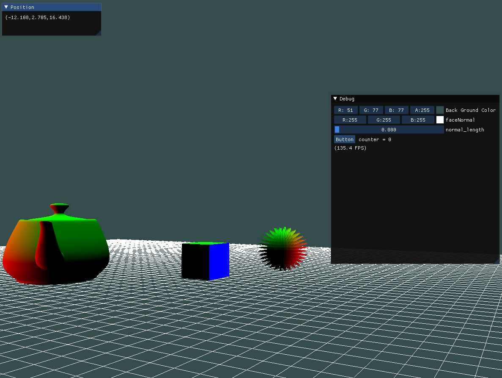
</p>

## 説明
1. 3Dモデリングを読み込む(assimp, std_image, glm)
2. 3DモデリングにShader適用
3. UI System構築してShaderパラメータ登録(imgui)
4. Shaderパラメータを修正してShaderを修正

## 操作説明
1. カメラ回転：マオス右クリックのままドラッグ
2. カメラ移動：キーボード W(上),S(下),A(左),D(右)

<div style="page-break-before:always"></div> 

# Grid描画

## source code
```cpp
//Grid.cpp
void Grid::Draw(Shader shader, glm::mat4 projection, glm::mat4 view)
{
//=======================
//中略
//=======================
	for (int i = 0; i < Column; i++)
	{
		glm::mat4 model = glm::mat4(1.0f);
		model = glm::translate(model, glm::vec3(Position.x + i - (Column/2), Position.y, Position.z));
		model = glm::scale(model, glm::vec3(Column));
		shader.setMat4("model", model);
		line.Draw();
	}

//Line.cpp
float VerticalLine[] = 
{
    0.0f , 0.0f,  -0.5f,
    0.0f , 0.0f,  0.5f,
};

void Line::Draw()
{
	glBindVertexArray(VAO);
	glDrawArrays(GL_LINES, 0, 2);
	glBindVertexArray(0);
}

//Game.cpp
Grid grid(100, 100);
grid.setPosition(glm::vec3(0, -2.0f, 0));
grid.Draw(gridShader, projection, view);
```

<div style="page-break-before:always"></div> 


# 背景の色変更
<p align= "center"> 
   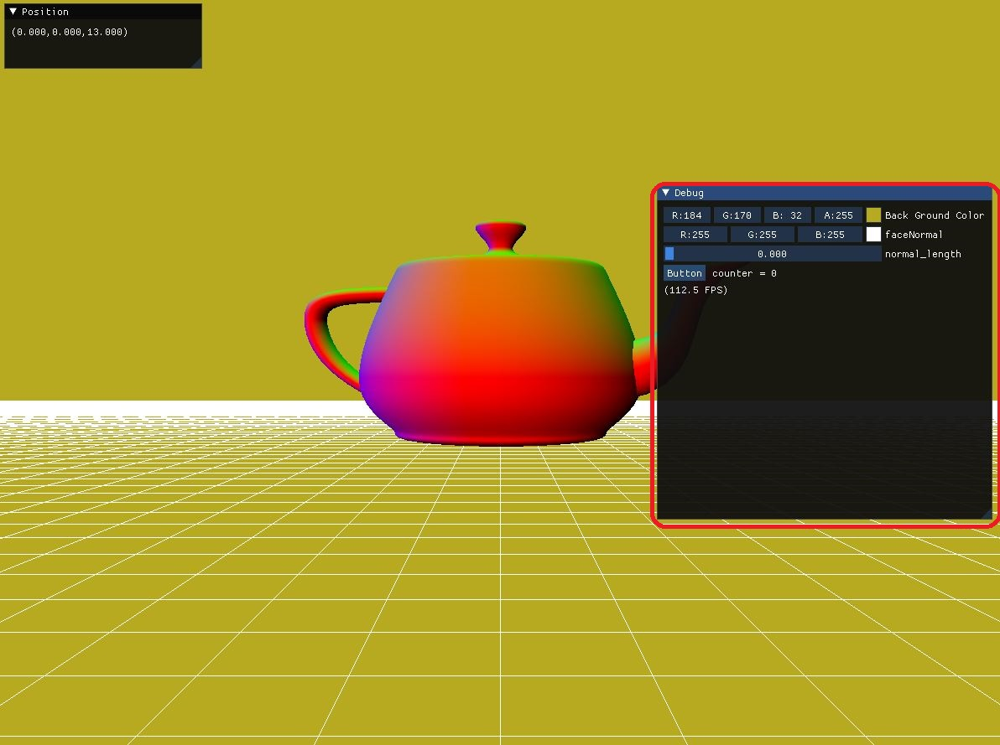
   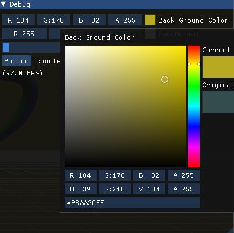
</p>

## 説明
色のパレットを修正して背景色が変わる。

## Source Code
``` cpp
//UI_Manager.cpp
//Update Fuction
glm::vec4 BackGroundColor;
ImGui::ColorEdit4("Back Ground Color", &BackGroundColor.x);

//Game.cpp
//Renderer Function
glm::vec4 vec(ui_Manager->getBackGroundColor());
float* data = glm::value_ptr(vec);
glClearColor(data[0], data[1], data[2], data[3]);
```

<div style="page-break-before:always"></div> 

# 3D Modeling

## Sphere
<p align= "center">
   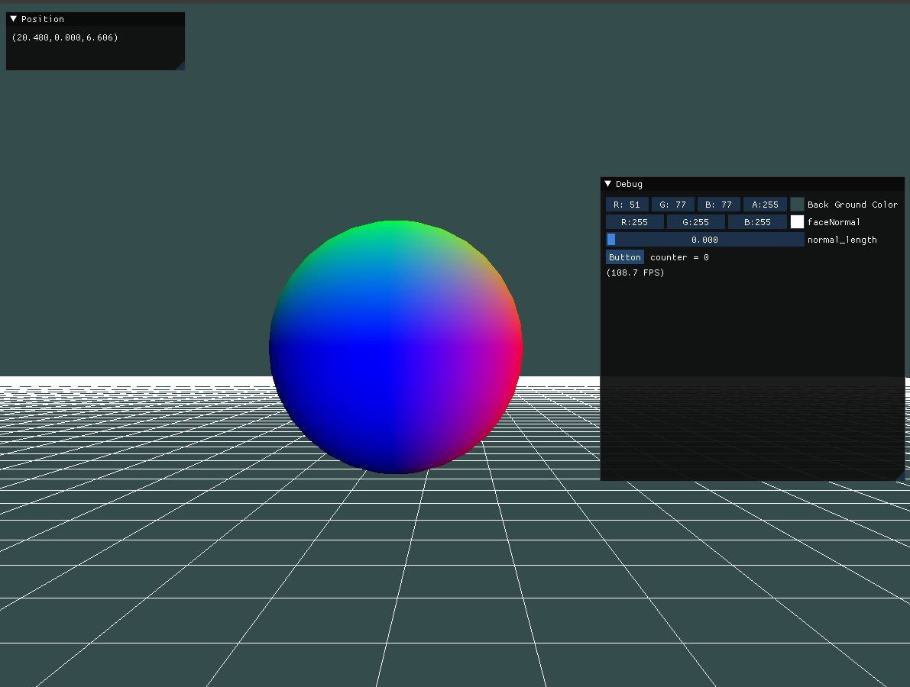
   <!--
   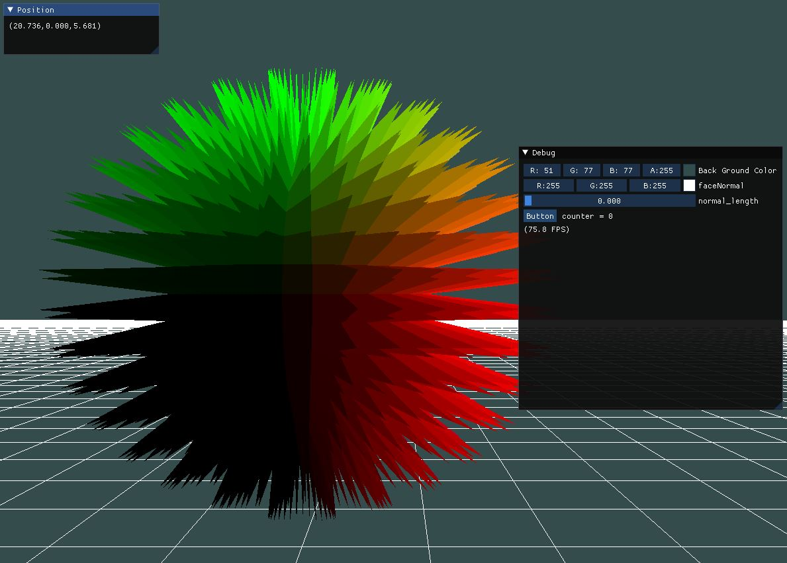
   -->
   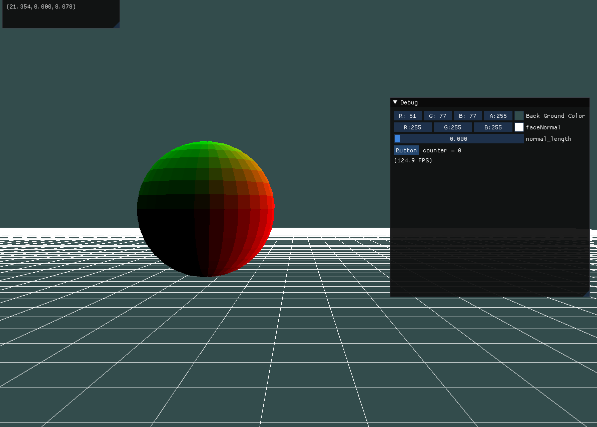

</p>

<p align= "center"> 
左）Shader未適用、右）Shader適用後
</p>

## 説明
時間によって刺が生成

## Gemotry Shader(Unity Shader参考)
``` glsl
//Thorn.gs
//参考サイト : http://www.shaderslab.com/demo-80---triangles-to-pyramids.html

#version 330 core
layout (triangles) in;
layout (triangle_strip, max_vertices = 12) out;

//=========================================
//中略
//=========================================

void main() {
    normal = GetNormal();
  
    vec4 CentralPos = (gl_in[0].gl_Position + gl_in[1].gl_Position + gl_in[2].gl_Position) / 3;
    vec2 CenterTex = (gs_in[0].texCoords + gs_in[1].texCoords + gs_in[2].texCoords) / 3;

    CentralPos += vec4(normal, 0) * abs(sin(time)) * 2;

    for(int i = 0; i < 3; i++)
    {
        gl_Position = gl_in[i].gl_Position;
        TexCoords = gs_in[i].texCoords;
        EmitVertex();
        gl_Position = CentralPos;
        TexCoords = CenterTex;
        EmitVertex();
        int nexti = (i + 1) % 3;
        gl_Position = gl_in[nexti].gl_Position;
        TexCoords = gs_in[nexti].texCoords;
        EmitVertex();
    }
    
    gl_Position = gl_in[2].gl_Position;
    EmitVertex();
    gl_Position = gl_in[1].gl_Position;
    EmitVertex();
    gl_Position = gl_in[0].gl_Position;
    EmitVertex();
    EndPrimitive();
}
```

## rabbit(explode)
<p align= "center">
   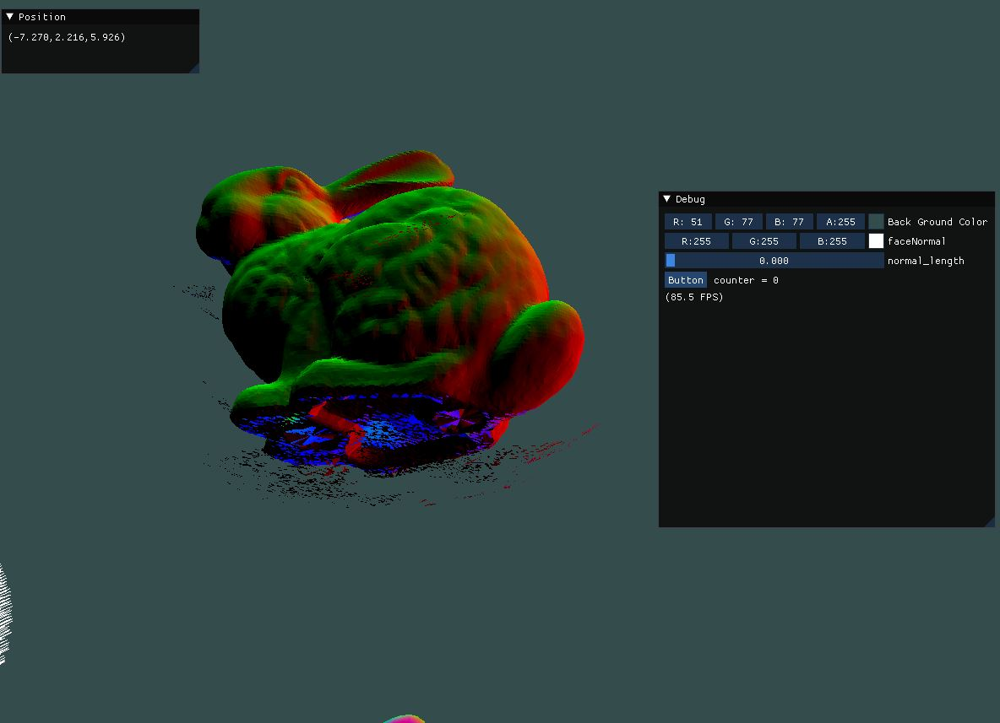
   <!--
   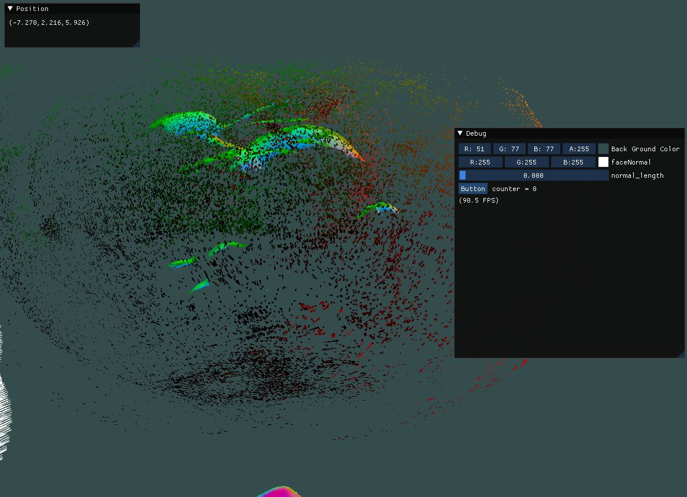
    -->
   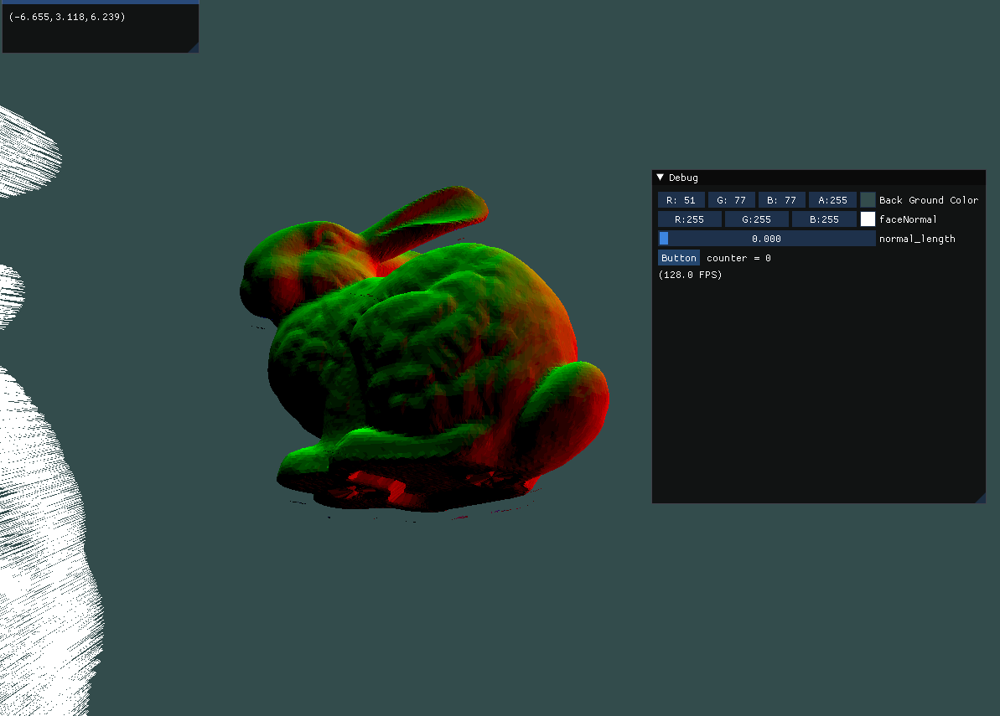
</p>

<p align= "center"> 
左）Shader未適用、右）Shader適用後
</p>

### 説明
時間によってモデルが小さいポリゴンで分解する。

### Gemotry Shader
``` glsl
//参考サイト：https://learnopengl.com/Advanced-OpenGL/Geometry-Shader
//explode.gs
#version 330 core
layout (triangles) in;
layout (triangle_strip, max_vertices = 3) out;
//=========================================
//中略
//=========================================
vec4 explode(vec4 position, vec3 normal) {
    float magnitude = 5.0f;
    vec3 direction = normal * ((sin(time) + 1.0) / 2.0) * magnitude;
    vec4 col = position + vec4(direction, 0.0) * step(normal.y, sin(time));
    return col;
}

void main() {
    normal = GetNormal();

    gl_Position = explode(gl_in[0].gl_Position, normal);
    TexCoords = gs_in[0].texCoords;
    EmitVertex();
    gl_Position = explode(gl_in[1].gl_Position, normal);
    TexCoords = gs_in[1].texCoords;
    EmitVertex();
    gl_Position = explode(gl_in[2].gl_Position, normal);
    TexCoords = gs_in[2].texCoords;
    EmitVertex();
    EndPrimitive();
}
```

## rabbit(nomal face)
<p align= "center">
   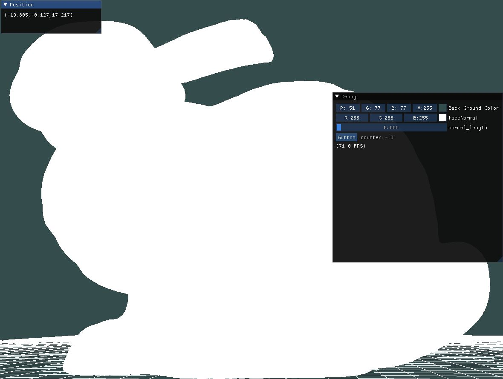
   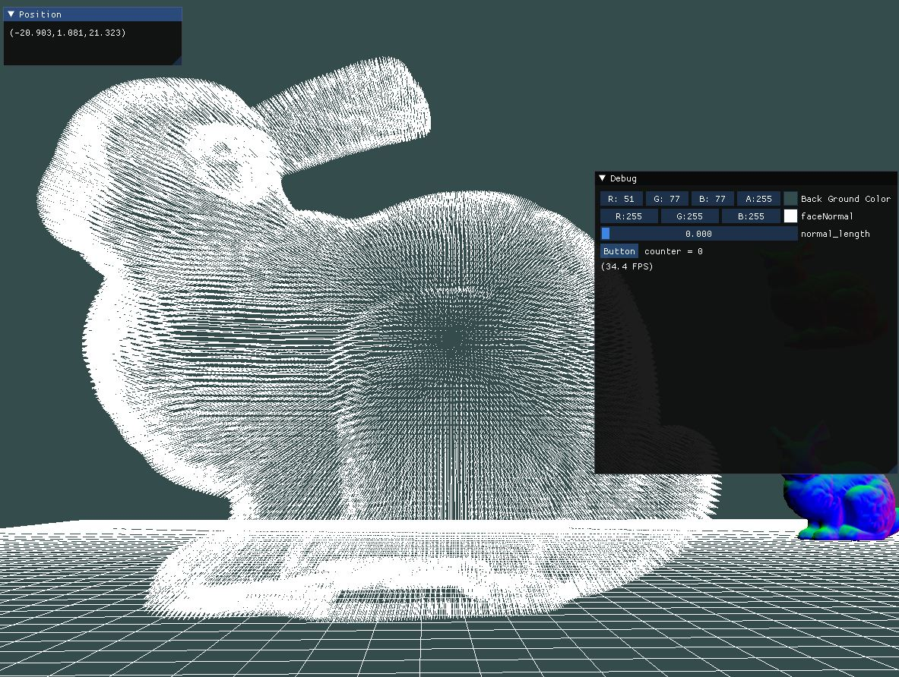
</p>

<p align= "center"> 
左）Shader未適用、右）Shader適用後
</p>

### 説明
ポリゴンのNormal Vectorの向きを表示

<div style="page-break-before:always"></div> 

### Gemotry Shader
``` glsl
#version 330 core
layout (triangles) in;
layout (line_strip, max_vertices = 6) out;

uniform float normal_length;
//==============================
//中略
//==============================
void main()
{
    normal = GetNormal();

    for(int i = 0; i < gl_in.length(); i++)
    {
        vec4 p = gl_in[i].gl_Position;
        vec3 N = GetNormal();

        gl_Position = p;
        EmitVertex();

        gl_Position = p + vec4(N * normal_length , 1.0f);
        EmitVertex();

        EndPrimitive();
    }
}
```
