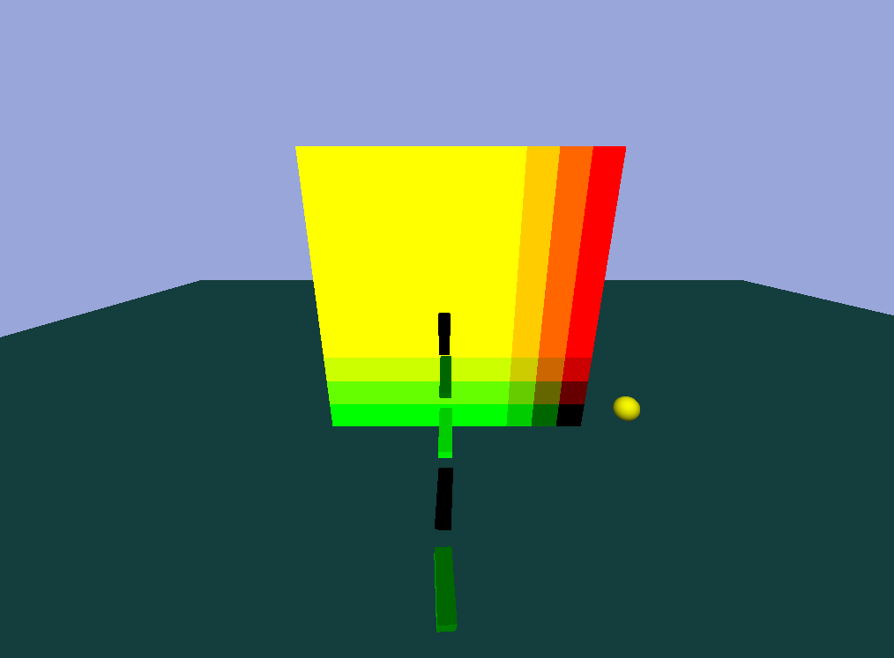
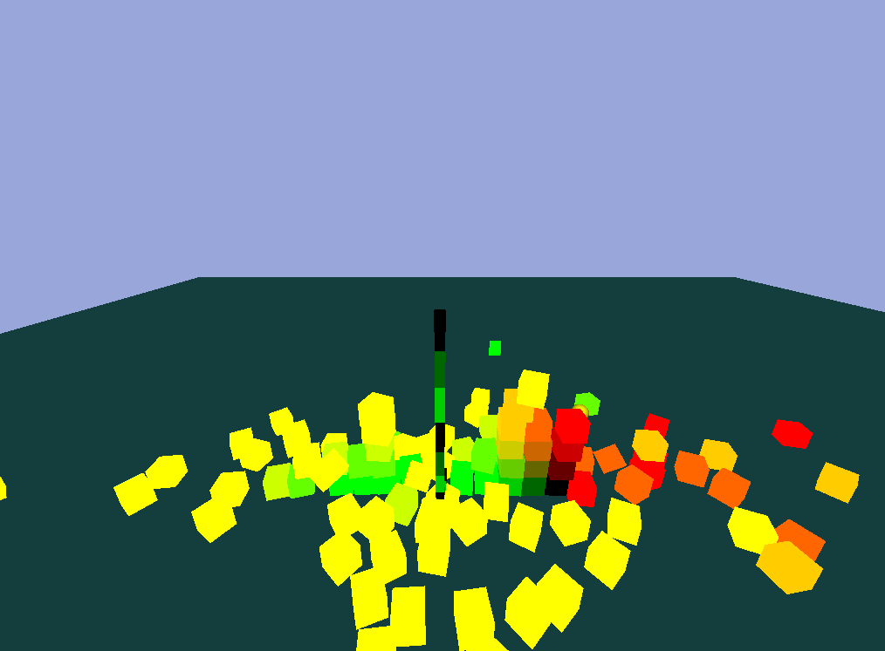
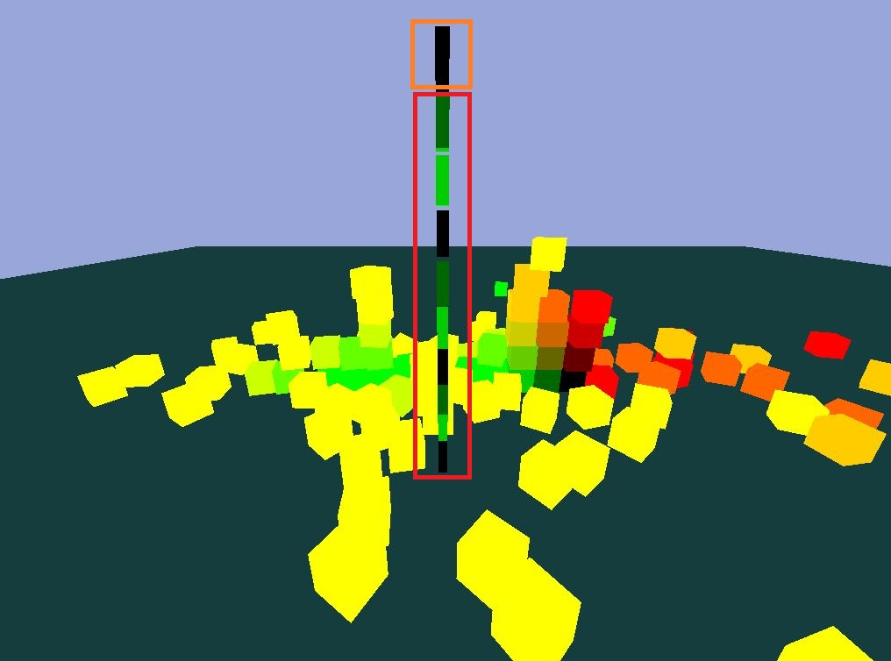

# Hello_Bullet_Engine

## 使用言語
* C++

## 使用ライブラリ
* Bullet Physics SDK：https://github.com/bulletphysics/bullet3
* GLEW：http://glew.sourceforge.net/
* FreeGLUT：http://freeglut.sourceforge.net/

## 参考サイト
* 真似したサイト：https://github.com/THISISAGOODNAME/bulletOpenGL
* FOV理論：https://blog.codinghorror.com/widescreen-and-fov/
* Bullet Physics 公式ドキュメント：https://github.com/bulletphysics/bullet3/tree/master/docs

## 使用ツール
* Visual Studio 2019

## 製作人数
* 個人 

## 製作者
* LEE GEONHWI(イゴンヒ)

## 制作期間
* 2020.02.26 ~ 未定

## オリジナルコード比率
* 7 : 3(参考サイト：オリジナル)

## 制作意図
ゲームエンジンに頼まずに物理演算の実装に興味があって**研究目的**で  
参考サイトを見ながらプログラムを製作中です。

## 感想点
物理エンジンを触るのが初めてなので**自分のオリジナルコードが少ないですが**  
次のプロジェットは物理エンジン、GLSL(Shaer)を使ってオリジナル物理シミュレーションプログラム（ゲーム）作りを考えています。

## 動画(YouTube)
[https://www.youtube.com/watch?v=LPJUOyeQz5w](https://www.youtube.com/watch?v=LPJUOyeQz5w)

## GitHub URL
[https://github.com/congibab/Hello_Bullet_Engine](https://github.com/congibab/Hello_Bullet_Engine)

# プログラム実装画面


## 操作系（CapsLockがOFF基準）
* W,S,A,Dでプレイヤー移動
* Rでシーンリセット
* ZでCollision表示（当たり判定表示）
* ←、→、↑、↓でカメラ回転
* スペースでジャンプ
* オブジェクト向きでマウス左クリニックで**プレイヤー変更**

# クラス説明
* main.cpp
* Callback.h => OpenGL関連コールバック関連クラス
* App.cpp => レンダリング、操作系関連クラス
* Basic.cpp（App継承）=> シーン初期化 ,オブジェクト配置、プレイヤー操作系関連クラス
* GameObject.cpp => オブジェクトクラス
* DebugDrawer.cpp (btIDebugDraw継承) => 当たり判定表示
* OpenGLMotionState.cpp (btDefaultMotionState継承) => オブジェクトのTransformを行列変換

<div style="page-break-before:always"></div> 

# シーン初期化
```cpp
//BasicDemo.cpp
void BasicDemo::InitPhysics()
{
	m_pCollisionConfiguration = new btDefaultCollisionConfiguration();
	m_pDispatcher = new btCollisionDispatcher(m_pCollisionConfiguration);
	m_pBroadphase = new btDbvtBroadphase();
	m_pSolver = new btSequentialImpulseConstraintSolver();
	m_pWorld = new btDiscreteDynamicsWorld(m_pDispatcher, m_pBroadphase, m_pSolver, m_pCollisionConfiguration);
	m_pWorld->setGravity(btVector3(0, -10, 0));

	CreateObjects();
}
```

# GameObject
```cpp
//GameObject.cpp
GameObject::GameObject(btCollisionShape* pShape, float mass, const btVector3& color, const btVector3& initialPosition, const btQuaternion& initialRotation)
{
	m_pShape = pShape;
	m_color = color;

	Tag = "default";

	btTransform transform;
	transform.setIdentity();
	transform.setOrigin(initialPosition);
	transform.setRotation(initialRotation);

	m_pMotionState = new OpenGLMotionState(transform);
	btVector3 locallnertia(0, 0, 0);

	if (mass != 0.0f)
		pShape->calculateLocalInertia(mass, locallnertia);

	btRigidBody::btRigidBodyConstructionInfo clnfo(mass, m_pMotionState, pShape, locallnertia);
	m_pBody = new btRigidBody(clnfo);
}
```

<div style="page-break-before:always"></div> 

# RayCast、座標変換


## 説明
* Window座標をWorld座標に変換(FOV計算)
* Bullet PhysicsのrayTest関数利用
* オブジェクト上にマウス左クリックするとプレイヤー変更ができる。

# Point to Point Constraint(プログラム実装画面参考)



## 説明
* btPoint2PointConstraintクラスを使用チェーインを具現（赤ボックス）
* チェーインは慣性に影響を受ける。

<div style="page-break-before:always"></div> 


## ソースコード
```cpp
//BasicDemo.cpp
	{
		GameObjects m_obj;
		for (int i = 0; i < 10; ++i)
		{
			float mass = 1;
			GameObject* p_obj;
		
			if (i == 0) mass = 0;		
			p_obj = CreateGameObject(new btBoxShape(btVector3(0.9, 0.25, 0.25)), mass, btVector3(0, i % 3, 0), btVector3(10, 20 , -10 - i * 2));
			m_obj.push_back(p_obj);
		}
		for (int i = 0; i < 9; ++i)
		{
			btPoint2PointConstraint* test1 = new btPoint2PointConstraint(*(m_obj[i]->GetRigidBody()), *(m_obj[i + 1]->GetRigidBody()), btVector3(-1.0, 0.5, 0), btVector3(1.0, 0.5, 0));
			m_pWorld->addConstraint(test1);

			btPoint2PointConstraint* test2 = new btPoint2PointConstraint(*(m_obj[i]->GetRigidBody()), *(m_obj[i + 1]->GetRigidBody()), btVector3(-1.0, -0.5, 0), btVector3(1.0, -0.5, 0));
			m_pWorld->addConstraint(test2);
		}
		Player = m_obj[0];
	}
```