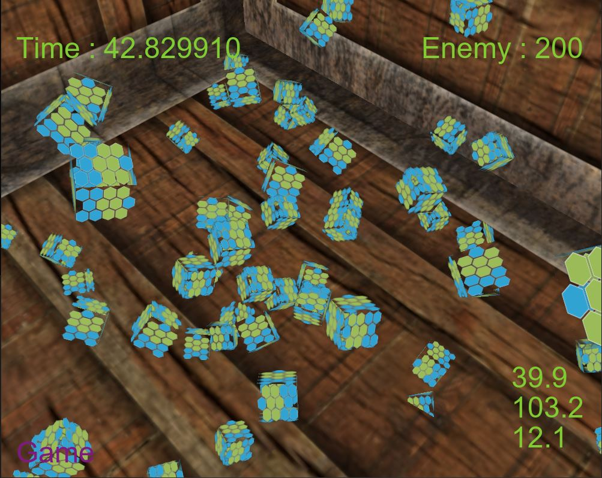
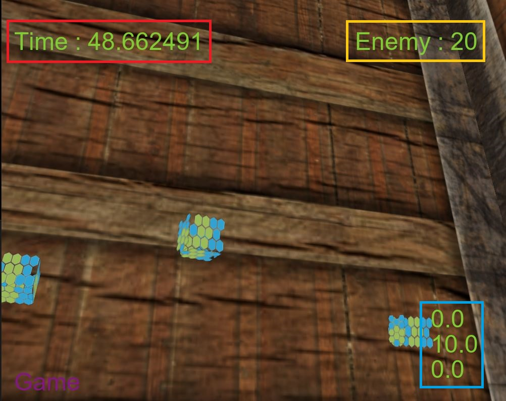
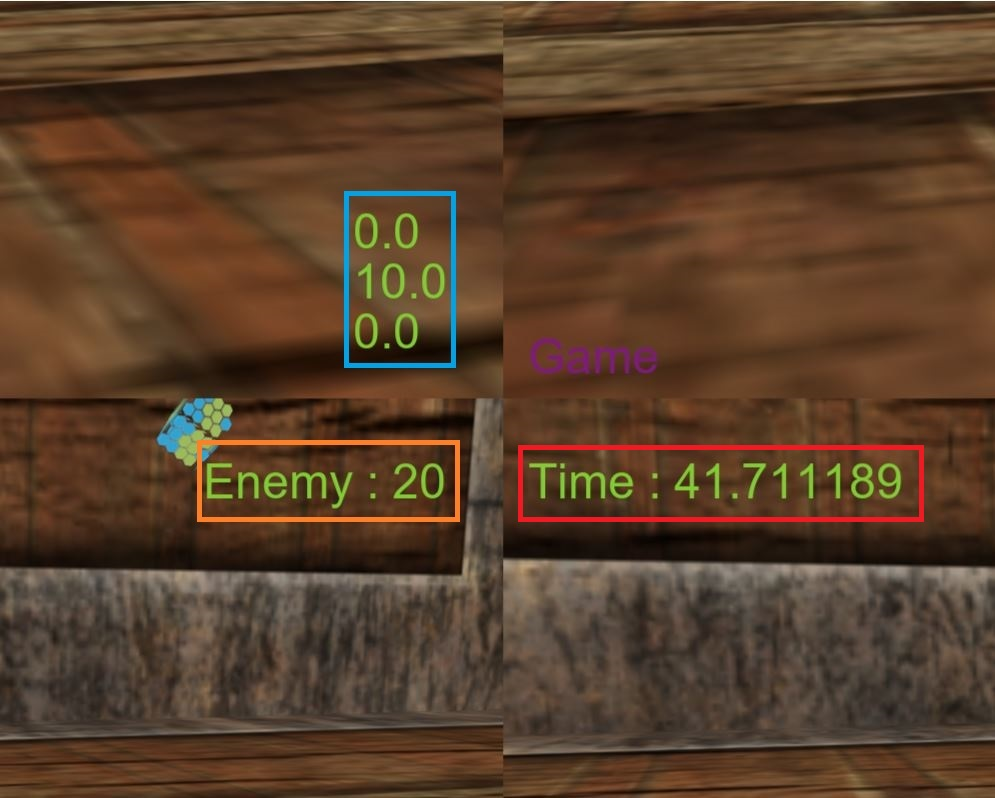
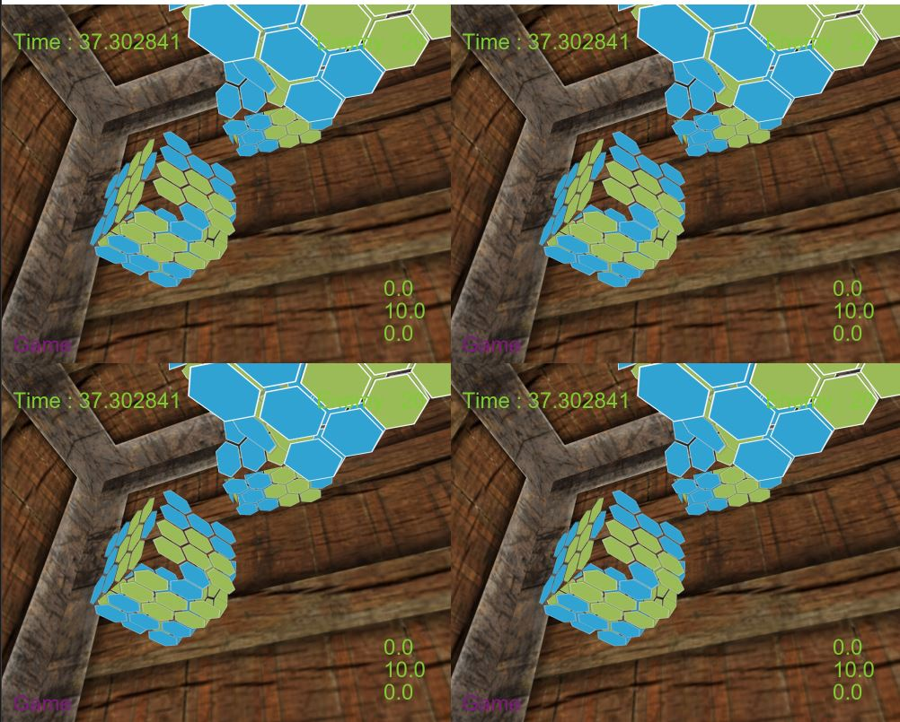
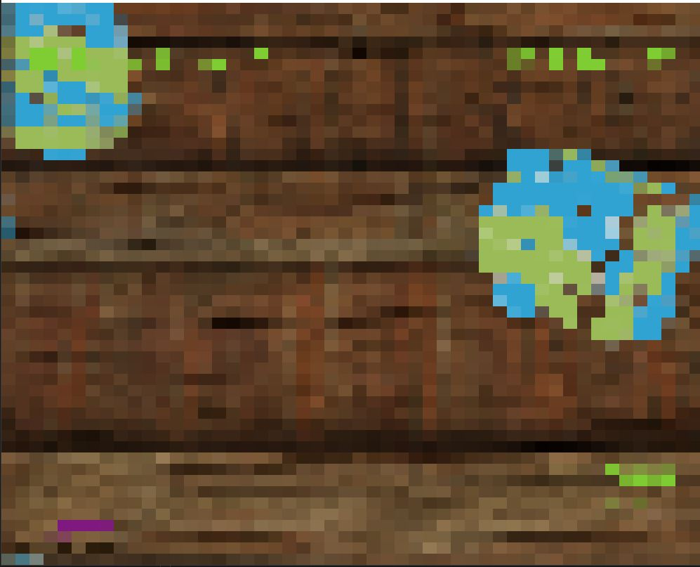
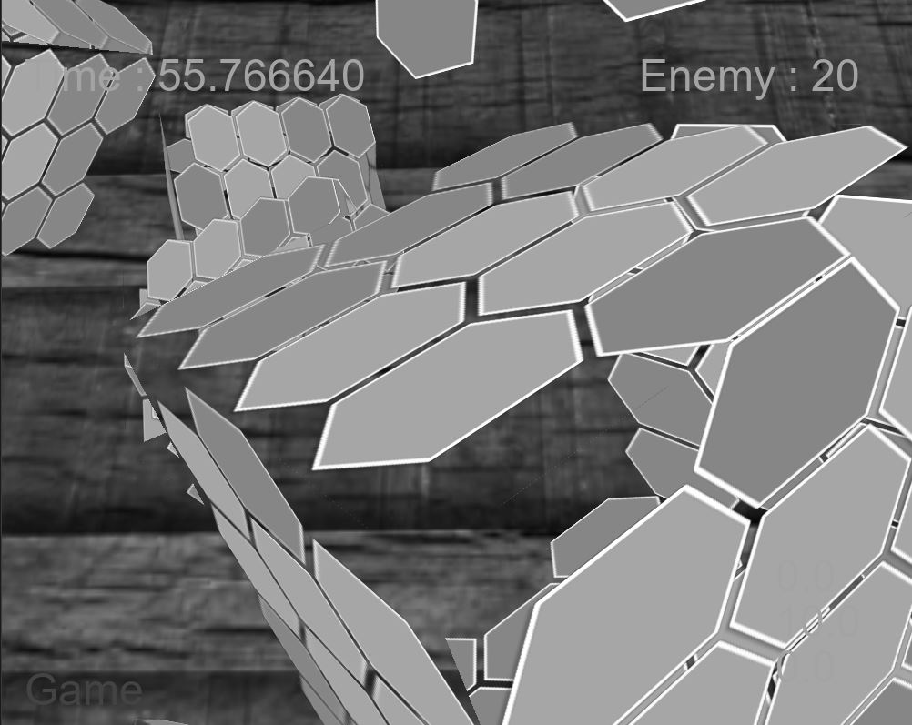

# OpenGLプロジェット概要
<!-- 
<div style="page-break-before:always"></div> 
-->

## 使用言語, ツール 
C++, GLSL, OpenGL  
Visual Studio 2019, Visual Studio Code

## 使用ライブラリ
GLFW3 : [https://www.glfw.org/](https://www.glfw.org/)  
glad : [https://glad.dav1d.de/](https://glad.dav1d.de/)  
glm : [https://github.com/g-truc/glm](https://github.com/g-truc/glm)  
std_image : [https://github.com/nothings/stb](https://github.com/nothings/stb)  
FreeType : [https://www.freetype.org/](https://www.freetype.org/)  

## 制作期間
2020年10月~2020年12月

## 開発人数
個人制作

## 製作者
LEE GEONHWI(イゴンヒ)

## 動画(YouTube)
[https://youtu.be/C13nFixrUdM](https://youtu.be/C13nFixrUdM)

## 参考サイト
[https://learnopengl.com/](https://learnopengl.com/)

## github URL
[https://github.com/congibab/OpenGL_Game](https://github.com/congibab/OpenGL_Game)

# 制作意図
学校にはUE4授業がないため独学でチャレンジしました。  
しかしC++知識が無かったのでgraphics librasyを参考にするこてでC++の勉強になると考えました。 
その中、Learn openglと言うsiteを見つけてSourc Codeを見ながら真似をして作成した初めてのC++ Programになります。


<div style="page-break-before:always"></div>

# プログラム画面
<p align="center">
   
</p>

## プログラム画面説明
1. W,S,A,Sでカメラ移動
2. マウス移動でカメラ回転
4. Enemy(右上)cubeの数
5. Canera position(右下) 上からｘ、ｙ、ｚ
6. cubeに当たったらキューブは消える。（Enemyの数字が減少する）
7. cubeが0になる及びTime(左上)が0になったらプログラム終了

## Cubeオブジェクトで実装した機能
1. Texture適用
2. Cube移動と移動向きによって回転
3. 当たり判定適用


<div style="page-break-before:always"></div>

# Cubeオブジェクトのソース(一部抜粋)
## Cube vertices(Front面だけ)
```cpp
//cube.cpp
    float vertices[] = {
        //local positions     //normals    //texture coords
        -0.5f, -0.5f, -0.5f,  0.0f,  0.0f, -1.0f,  0.0f,  0.0f,
         0.5f, -0.5f, -0.5f,  0.0f,  0.0f, -1.0f,  1.0f,  0.0f,
         0.5f,  0.5f, -0.5f,  0.0f,  0.0f, -1.0f,  1.0f,  1.0f,
         0.5f,  0.5f, -0.5f,  0.0f,  0.0f, -1.0f,  1.0f,  1.0f,
        -0.5f,  0.5f, -0.5f,  0.0f,  0.0f, -1.0f,  0.0f,  1.0f,
        -0.5f, -0.5f, -0.5f,  0.0f,  0.0f, -1.0f,  0.0f,  0.0f,
    };
```
## Shaderに値(変数vertices)を渡す
```cpp
//cube.cpp
    glGenVertexArrays(1, &cubeVAO);
    glGenBuffers(1, &VBO);

    glBindBuffer(GL_ARRAY_BUFFER, VBO);
    glBufferData(GL_ARRAY_BUFFER, sizeof(vertices), vertices, GL_STATIC_DRAW);

    glBindVertexArray(cubeVAO);

    glVertexAttribPointer(0, 3, GL_FLOAT, GL_FALSE, 8 * sizeof(float), (void*)0);//local positions data
    glEnableVertexAttribArray(0); //layout (location = 0)にlocal Positionを渡す
    glVertexAttribPointer(1, 3, GL_FLOAT, GL_FALSE, 8 * sizeof(float), (void*)(3 * sizeof(float)));// normals data
    glEnableVertexAttribArray(1); //layout (location = 1)にnormals dataを渡す
    glVertexAttribPointer(2, 2, GL_FLOAT, GL_FALSE, 8 * sizeof(float), (void*)(6 * sizeof(float)));// texture coords data
    glEnableVertexAttribArray(2); //layout (location = 2)にtexture coords dataを渡す
}
```
<div style="page-break-before:always"></div>

## 行列変換(座標、回転、スケール)
```cpp
//cube.cpp
	glm::vec3 Position;
	glm::vec3 Rotation;
	glm::vec3 Scale;
//============================
//中略
//============================
    glm::mat4 model = glm::mat4(1.0f);
    model = glm::translate(model, Position); //オブジェクトの座標(World Position)
    model = glm::rotate(model, angle, Rotation); //回転(角度,方向)
    model = glm::scale(model, Scale); // スケール設定

    glUniformMatrix4fv(glGetUniformLocation(ID, "model", 1, GL_FALSE, &mat[0][0]);
    //uniform mat4 modelに渡す
```
```glsl
//Cube.vs
#version 330 core
layout (location = 0) in vec3 aPos; //cpuから貰ったlocal positions dataをaPosとして宣言
layout (location = 1) in vec3 aNormal;
layout (location = 2) in vec2 aTexCoords;

uniform mat4 model; //glUniformMatrix4fv(glGetUniformLocation(ID, "model", 1, GL_FALSE, &mat[0][0]);
```

## 使用例
```cpp
//game.cpp
Shader shader("vertex shader path", "fragment shader path")
Cube* cube;
cube->Update(DeltaTime); //DeltaTimeはglfwGetTime()関数を使用して計算
cube->Draw(shader, projection, view); //projection, viewsはカメラProperty
delete cube //オブジェクト解除
```
<div style="page-break-before:always"></div>

# 当たり判定
## game.cpp
```cpp
bool Game::CollisionAABB(Cube* Target, Cube* box)
{
	return (Target->GetMinPos().x <= box->GetMaxPos().x && Target->GetMaxPos().x >= box->GetMinPos().x) &&
		(Target->GetMinPos().y <= box->GetMaxPos().y && Target->GetMaxPos().y >= box->GetMinPos().y) &&
		(Target->GetMinPos().z <= box->GetMaxPos().z && Target->GetMaxPos().z >= box->GetMinPos().z);
}
```
# post processing(ScreenMoving)

<p align="center">


</p>
<p align="center"> <strong>左）</strong>適用前、<strong>右）</strong>適用後</p> 

## 適用説明
1, Texture座標を少しずつ右上に画面が移動する。  
2, 右上の最後の地点に経ったらその分Texture座標は左下に移動させる。  
3, 1番と2番の繰り返し。

## プログラムの操作説明
1. マウス**左**クリックで次のShaderに変換
2. マウス**右**クリックで前のShaderに変換

<div style="page-break-before:always"></div>

## 適用の流れ
1. FrameBuffer生成
2. Sceneを描く場所を指定(**生成したFrameBuffer**)
3. 指定したFrameBufferにGameSceneを描いて保存
4. **生成**したFrameBufferを**default** FrameBufferに変更
5. PostProcessingを適用したいなオブジェクト生成（四角形）
6. 四角形にTexture(**Post Processingを適用し、Objectの生成（四角形）**)を適用する
7. Shaderを適用する

## ScreenRender.Cpp(FrameBuffers生成)

```cpp
ScreenRender::ScreenRender()
{
	glGenFramebuffers(1, &framebuffer);
	glBindFramebuffer(GL_FRAMEBUFFER, framebuffer);
	//=============================================
	glGenTextures(1, &textureColorbuffer);
	glBindTexture(GL_TEXTURE_2D, textureColorbuffer);
	glTexImage2D(GL_TEXTURE_2D, 0, GL_RGB, Setting::SCR_WIDTH, Setting::SCR_HEIGHT, 0, GL_RGB, GL_UNSIGNED_BYTE, NULL);
	glTexParameteri(GL_TEXTURE_2D, GL_TEXTURE_MIN_FILTER, GL_LINEAR);
	glTexParameteri(GL_TEXTURE_2D, GL_TEXTURE_MAG_FILTER, GL_LINEAR);
	glBindTexture(GL_TEXTURE_2D, 0);
	//=============================================
	glFramebufferTexture2D(GL_FRAMEBUFFER, GL_COLOR_ATTACHMENT0, GL_TEXTURE_2D, textureColorbuffer, 0);
	//=============================================
	glGenRenderbuffers(1, &rbo);
	glBindRenderbuffer(GL_RENDERBUFFER, rbo);
	glRenderbufferStorage(GL_RENDERBUFFER, GL_DEPTH24_STENCIL8, Setting::SCR_WIDTH, Setting::SCR_HEIGHT);
	glBindRenderbuffer(GL_RENDERBUFFER, 0);
	//=============================================
	glFramebufferRenderbuffer(GL_FRAMEBUFFER, GL_DEPTH_STENCIL_ATTACHMENT, GL_RENDERBUFFER, rbo);
	glBindFramebuffer(GL_FRAMEBUFFER, 0);
}
```
<div style="page-break-before:always"></div>

## quad.h.cpp(四角形生成)
```cpp
float quadVertices[] = {
		-1.0f,  1.0f,  0.0f, 1.0f, //positions(-1.0f, 1.0f)　texCoords(0.0f,1.0f)
		-1.0f, -1.0f,  0.0f, 0.0f,
		 1.0f, -1.0f,  1.0f, 0.0f,

		-1.0f,  1.0f,  0.0f, 1.0f,
		 1.0f, -1.0f,  1.0f, 0.0f,
		 1.0f,  1.0f,  1.0f, 1.0f
};
//中略
    //shaderを登録して
	Shaders.push_back(Shader("Shader/framebuffers_screen.vs", "Shader/framebuffers_screen.fs"));
	Shaders[Shaders_indice].setFloat("Time", glfwGetTime());
	Shaders[Shaders_indice].use();
```

## 使用例
```cpp
//Main.CPP
#include "ScreenRender.h"
#include "Game.h"
#include "quad.h"

//中略
	game = new Game();
	scrennRender = new ScreenRender();
	_quad = new quad();
	while (!glfwWindowShouldClose(window))
	{
		gametime.Time_Measure();
   		scrennRender->use(); //生成したFramebufferに設定

        //Scene描く
		game->SetCameraPos(camera.Position);
		game->Update(gametime.GetDeltaTime());
		game->Draw(projection, view);
		
		scrennRender->free();//default Framebufferに設定
        //生成したFramebufferからSceneDataをtexture化して得取
		_quad->SetTexture(scrennRender->GetTextureColorbuffer());
		_quad->Draw();

		gametime.DeltaTime_Update();
		glfwSwapBuffers(window);
		glfwPollEvents();
	}
```

## vertex shader
```glsl
#version 330 core
layout (location = 0) in vec3 aPos;
layout (location = 1) in vec2 aTexCoords;

out vec2 TexCoords;

void main()
{
    TexCoords = aTexCoords;
    gl_Position = vec4(aPos.x, aPos.y, 0.0f, 1.0f);
}
```
## fragmant shader
```glsl
#version 330 core
out vec4 FragColor;

in vec2 TexCoords;

uniform sampler2D screenTexture;
uniform float Time;

void main()
{
    vec3 col = texture(screenTexture, TexCoords + sin(Time)).rgb;
    FragColor = vec4(col, 1.0f);
}
```
<div style="page-break-before:always"></div>

# その他のpost processing

## 画面分割
<p align="center"></p>

## モザイク
<p align="center"></p>

## グレースケール
<p align="center"></p>