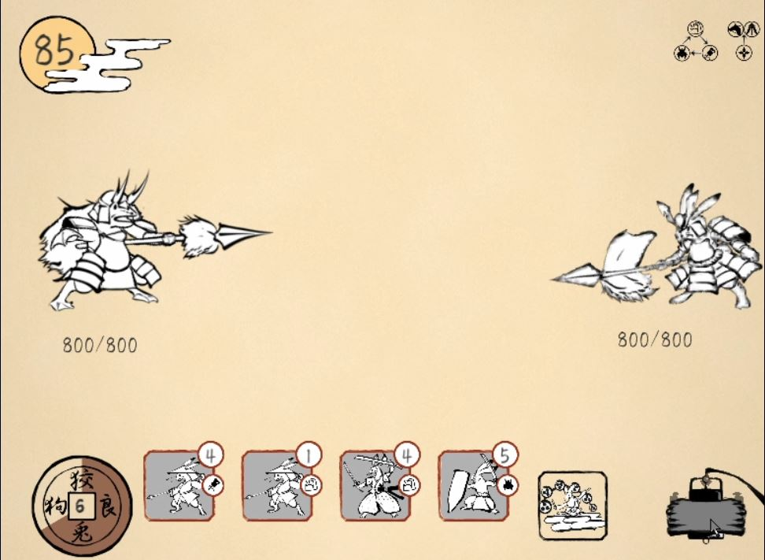

# プロフィール
* 名前 : LEE GEONHWI(イ ゴンヒ)
* 所属 : 東京デザインテクノロジーセンター専門学校 
* 専攻 : ゲームプログラマー専攻、3年生 

## スキル
<!--
|   言語   |      期間      |  <=>  |       ツール       |      期間      |
| :------: | :------------: | :---: | :----------------: | :------------: |
|    C#    | 2019.05 ~ 現在 |  <=>  |       Unity        | 2019.05 ~ 現在 |
|   C++    | 2020.08 ~ 現在 |  <=>  |   Visual Studio    | 2019.05 ~ 現在 |
|   GLSL   | 2020.08 ~ 現在 |  <=>  | Visual Studio Code | 2020.08 ~ 現在 |
| Node.js  | 2020.11 ~ 現在 |  <=>  |       Linux        | 2020.08 ~ 現在 |
| Markdown | 2020.12 ~ 現在 |  <=>  |      Jenkins       | 2020.12 ~ 現在 |
|   PHP    | 2021.03 ~ 現在 |  <=>  |       Docker       | 2021.03 ~ 現在 |
-->
<table style="width:100%">
  <tr>
    <th>言語</th> <th>期間</th> <th><=></th> <th>ツール</th> <th>期間</th>
  </tr>

  <tr>
    <td>C#</td> <td>2019.05 ~ 現在</td> <td><=></td> <td>Unity</td> <td>2019.05 ~ 現在</td>
  </tr>

  <tr>
    <td>C++</td> <td>2020.08 ~ 現在</td> <td><=></td> <td>Visual Studio</td> <td>2019.05 ~ 現在</td>
  </tr>

  <tr>
    <td>GLSL</td> <td>2020.08 ~ 現在</td> <td><=></td> <td>Visual Studio Code</td> <td>2020.08 ~ 現在</td>
  </tr>

  <tr>
    <td>Node.js</td> <td>2020.11 ~ 現在</td> <td><=></td> <td>Linux</td> <td>2020.08 ~ 現在</td>
  </tr>

  <tr>
    <td>Markdown</td> <td>2020.12 ~ 現在</td> <td><=></td> <td>Jenkins</td> <td>2020.12 ~ 現在</td>
  </tr>

  <tr>
    <td>PHP</td> <td>2021.03 ~ 現在</td> <td><=></td> <td>Docker</td> <td>2021.03 ~ 現在</td>
  </tr>
</table>

# 目次(時間順)

## ビルド済みプログラム
* [GoogleDrive](https://drive.google.com/file/d/1cxbJQLiyP0gDSY1bFMXFtm5jp-qvrtqG/view?usp=sharing)

## 1.水墨鳥獣(チーム製作)

* 製作期間 : 2020.5 ~ 2021.2(毎週金曜日)
* コンセプト : キャラクターを召喚して敵を倒すゲームです。
* ジャンル : タワーディフェンス
* 製作意図 : 学校のチーム製作授業です。
* 使用言語 : C#  
* [ソースコード](./RabbitFrog)  
* [GitHub](https://github.com/kumamoooooon0202/RabbitFrog.git)
* [YouTube動画](https://youtu.be/mxTw6bZQGsE)▶️ **(字幕あり)**

## 2.OpenGL_Game

* 製作期間 : 2020.10 ~ 2020.12
* コンセプト : オブジェクト生清とPost processingを実装したプログラムです。
* 製作意図 : 3Dグラフィックス研究目的です。  
* 使用言語 : C++, GLSL  
* [ソースコード](./OpenGL_Game)
* [GitHub](https://github.com/congibab/OpenGL_Game)
* [YouTube動画](https://youtu.be/C13nFixrUdM)▶️ **(字幕あり)**

## 3.UnityServer

* 製作期間 : 2020.10 ~ 2020.12
* コンセプト : レンタルサーバーとUnityで使ったネットワークゲームです。  
* 製作意図 : Linux、Node.js研究目的です。
* 使用言語 : Node.js, C#  
* [ソースコード](./UnityServer)  
* [GitHub](https://github.com/congibab/UnityServer)
* [YouTube動画](https://youtu.be/Q4Arop1ba_M)▶️ **(字幕あり)**

## 4.Frist-imgui-glfw3

* 製作期間 : 2021.01 ~ 未定
* コンセプト : UIを具現してパラメータ修正でShaderを制御するプログラムです。
* 製作意図 : GLSL, Geometry Shader研究目的です。  
* 使用言語 : C++, GLSL  
* [ソースコード](./Frist-imgui-glfw3)  
* [GitHub](https://github.com/congibab/Frist-imgui-glfw3)
* [YouTube動画](https://youtu.be/h1-rcwjNfMk)▶️ **(字幕あり)**

## 5.Hello_bullet_Engine

* 製作期間 : 2021.02.26 ~ 未定
* コンセプト : OpenGLとBullet Physicsを使った物理演算プログラムです。
* 製作意図 : 物理エンジンライブラリ研究目的です。  
* 使用言語 : C++  
* [ソースコード](./Hello_bullet_Engine)  
* [GitHub](https://github.com/congibab/Hello_Bullet_Engine)
* [YouTube動画](https://youtu.be/LPJUOyeQz5w)▶️ **(字幕あり)**

## 6.Upload-Tool

* 製作期間 : 2021.4.6 ~ 2021.4.9
* コンセプト : イメージデータをData Baseへアップロードするツールです。
* 製作意図 : プランナーがData Baseを管理出来るようにする為に、ツールを作りました。
* 使用言語 : PHP, HTML5  
* [ソースコード](./Upload-Tool)  
* GitHub 未公開
* [YouTube動画](https://youtu.be/f2tdzeMfCnM)▶️ **(字幕あり)**
## 7.WindowForm

* 製作期間 : 2021.4.8 ~ 2021.4.10
* コンセプト : HTTP通信を使ってData Baseからイメージを取得するプログラムです。
* 製作意図 : ツール開発の研究目的です。  
* 使用言語 : C#  
* [ソースコード](./WindowForm)  
* [GitHub](https://github.com/congibab/HelloWindowForm)
* [YouTube動画](https://youtu.be/AXCVxSYtJSU)▶️ **(字幕なし)**

## 8. Unity_UdpSample

* 製作期間 : 2021.5.9 ~ 2021.5.11
* コンセプト : UnityでUDP通信テスト、クラス化練習です。
* 製作意図 : 他の学生さんにもUDP通信を使えるように、クラス化しました。
* 使用言語 : C#, Node.js
* [ソースコード](./Unity_UdpSample)  
* [GitHub](https://github.com/congibab/Unity_UdpSample)
* [YouTube動画](https://youtu.be/fKeTiaLIYA8)▶️ **(字幕あり)**