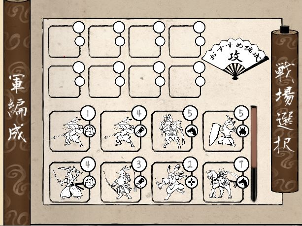
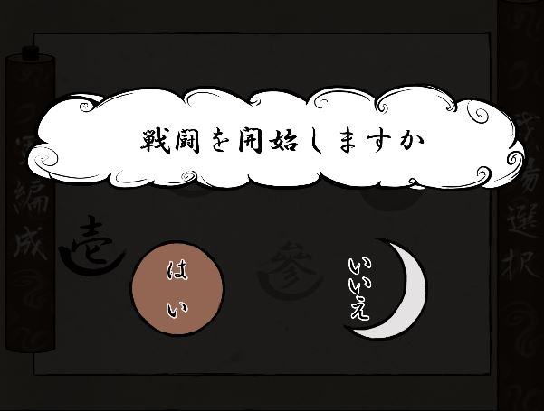
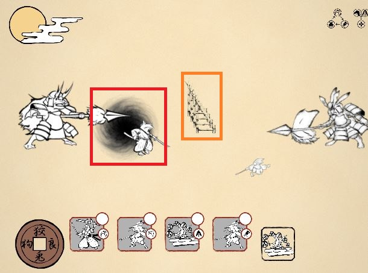
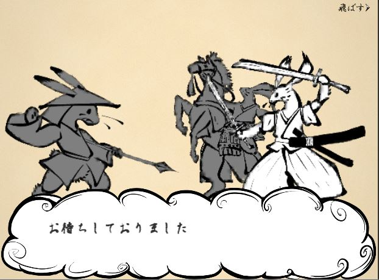

# 水墨鳥獣

## 制作理由
* チーム製作の経験する為の学校の授業です。

## ジャンル
* タワーディフェンス

## 実行環境
* iOS

## 使用ツール
* Unity

## 使用言語
* C#

## 制作期間
* 2020年5月~2021年2月(毎週金曜日)

## 制作人数
* 10人

## 動画(YouTube)

# 主な担当(プログラマー)

## UI全般



### スタート確認画面スクリプト
```csharp
ublic void NextScene()
{
    StartCoroutine(effect_sketch.NextScene(StageSelectControl.NextScene));
    DeckManager.SetDeckObject();
    confirmCanvas.rootCanvas.enabled = !confirmCanvas.rootCanvas.enabled;
}

public void Cencle()
{
    confirmCanvas.rootCanvas.enabled = !confirmCanvas.rootCanvas.enabled;
}
```

## プレイヤースキル


* マウス左クリックして直線や丸を書くことができる。
* 直線を書くと敵を止める壁を生成(黄色のボックス)
* 丸を書くと敵を吹き込むオブジェクトを生成(赤いボックス)

### 直線、丸を判定する。スクリプト
```csharp
//マウスをドラッグして線が終わる地点を決める
if (Input.GetMouseButton(0) && is_Drawing)
{

    endPos = Camera.main.ScreenToWorldPoint(new Vector3(Input.mousePosition.x,
                                                        Input.mousePosition.y,
                                                       -Camera.main.transform.position.z));

    if (!draw_able()) return;
    //マウスを動かないとlistの追加をしない
    if (Vector2.Distance(tempPos, endPos) < 0.5f) return;

    Points.Add(endPos);
    Points_X.Add(endPos);
    Points_Y.Add(endPos);

    Drawing_obj.transform.position = endPos;
    mouce_obj.transform.position = endPos;
    tempPos = endPos;
}
```

## エフェクト(動画参照)
* [動画](https://www.youtube.com/watch?v=mxTw6bZQGsE#t=22s)

### 巻物を開く、閉じるエフェクト
```csharp
public IEnumerator Open(RectTransform ObjTarget)
{
    OptionController.is_runing = true;
    ObjTarget.sizeDelta = new Vector2(75, 650);
    while (image.fillAmount <= 1)
    {
        if (image.fillAmount >= 1) break;
        yield return new WaitForSeconds(Time.deltaTime);
        image.fillAmount += Time.deltaTime;
    }
    OptionController.is_runing = false;
}

// 編成画面を閉じる処理
public IEnumerator Close(RectTransform ObjTarget)
{
    OptionController.is_runing = true;
    while (image.fillAmount >= 0)
    {
        if (image.fillAmount <= 0) break;
        yield return new WaitForSeconds(Time.deltaTime);
        image.fillAmount -= Time.deltaTime;
    }
    ObjTarget.sizeDelta = new Vector2(75, 450);
    OptionController.is_runing = false;
}
```
## 会話シーン全般


* プランナーがExcelで作業した会話データを適用

### 会話データ(CSV)をUnityで読み込む、スクリプト
```csharp
void CSVReader(string CSVPATH,
                List<string> text,
                List<string> Name,
                List<string> num)
{
    TextAsset data;

    data = Resources.Load(CSVPATH, typeof(TextAsset)) as TextAsset;
    StringReader sr = new StringReader(data.text);

    string line;
    string[] text_split;
    line = sr.ReadLine();

    while (line != null)
    {
        text_split = line.Split(',');
        Name.Add(text_split[0]); //name, text, num
        text.Add(text_split[1]); // 0  , 1   , 2
        num.Add(text_split[2]);
        line = sr.ReadLine();
    }
    //1行目を解除
    text.RemoveAt(0);
    Name.RemoveAt(0);
    num.RemoveAt(0);
}

```