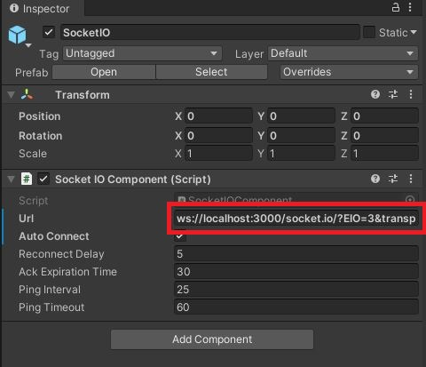
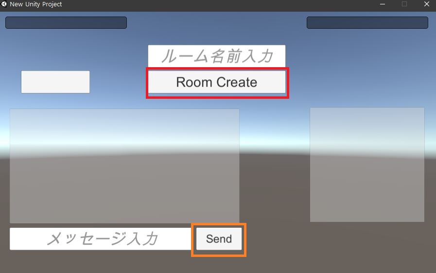
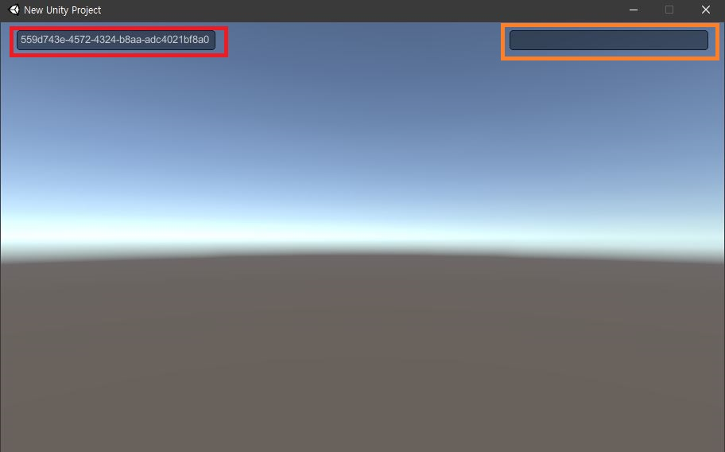
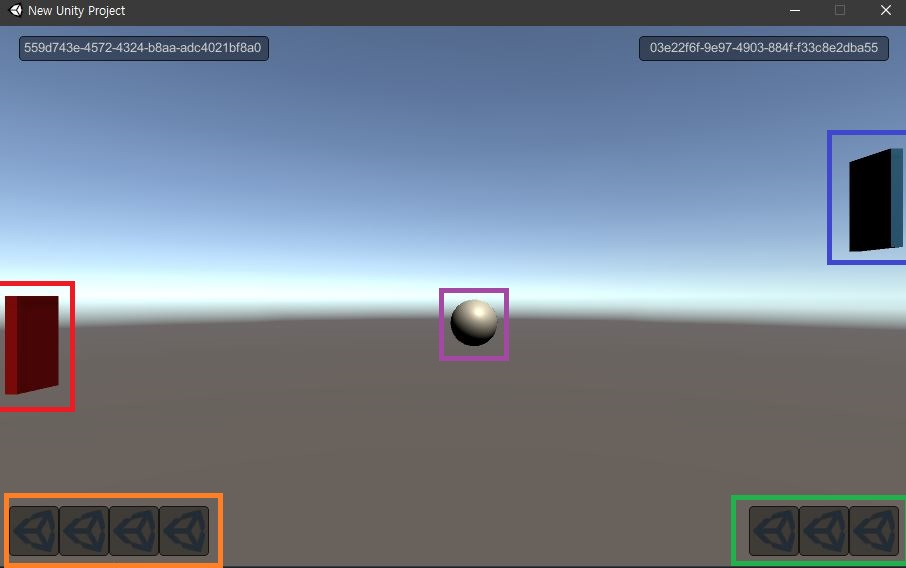
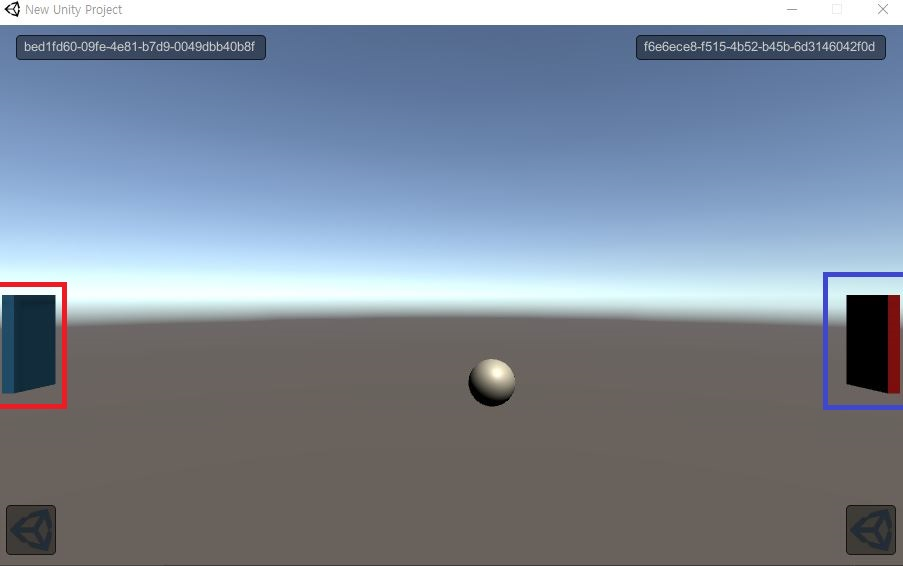

# SocketIOとUnityで利用したネットワーク通信ゲーム
## 使用言語
Node.js, C#
## 実行環境
Unity 2019.4.15f1  
Nodejs v14.15.0  
## 使用module(Server)
socketio 1.0.0  
uuid 8.3.2  
express 4.17.1  
http 0.0.1-security  
## 使用ライブラリ(Client)
SocketIO for Unity - v1.0.0(https://github.com/vedi/unity-socket.io) (**サポート終了**)
## 制作期間
2020年10月~2020年12月
## 開発人数
個人
## 製作者
LEE GEONHWI(イゴンヒ)

## 動画(YouTube)
[https://www.youtube.com/watch?v=Q4Arop1ba_M](https://www.youtube.com/watch?v=Q4Arop1ba_M)

## guthub URL
[https://github.com/congibab/UnityServer](https://github.com/congibab/UnityServer)

##  改善点
今回のProjectにはSocket.IOを使ったんですがUnity側のSocket.IO関連ライブラリは支援が終わりましたので  
次のserver関連Projectをやる時には外部ライブラリを使わずにSystem.Net.Socketsを使ってネットワークゲームを作りたいです。


<div style="page-break-before:always"></div>

# directory Path
```
UnityServer
│  .gitignore
│  README.md
│  
├─.vs
└─serverTest
    ├─Build
    ├─Client
    └─Server
        |  node_modules
        │  package-lock.json
        │  package.json
        │  php_deployment.sh
        │  tesdt.txt
        │  test.php
        │  
        └─node_modules
```

# server実行
```bash
cd <your Path>/UnityServer/Server
node index.js
//実行画面=====================================================
URL = ws://localhost:3000/socket.io/?EIO=4&transport=websocket
```

<div style="page-break-before:always"></div>

# Client実行(defaultは個人のレンタルサーバー)
## 接続したいIPを変更したい場合は
<p align="center"></p>

赤いbox : ws://**localhost**:3000/socket.io/?EIO=4&transport=websocket  
localhostのみ自分が変更したいなIPを変更

## Title画面(Client1)
<p align="center"></p>

赤いbox : Roomの名前入力してRoom Create **Button**を押すとゲームに入る。  
黄色box : Messageを入力してSend **Button**を押すとMassageをServerに**送信**する。  

<div style="page-break-before:always"></div>

## Title画面(Client2)
<p align="center"></p>

赤いbox : 生成されたRoom Listが表示してその**Button**を押すとゲームに入る。  
黄色box : Serverから**送信**されたMassageがあったらMassage内容を表示する。  
青い色box : ゲームの勝利を判定

## Game画面(待機)
<p align="center"></p>

赤いbox : Player1のUUIDを表示(先にRoomに入れたClient)  
黄色box : Player2のUUIDを表示(後にRoomに入れたClient)  **空白**ならまだPlayerは入れてない状態  
Client1は別のClient2が入るまでに待機する。  

<div style="page-break-before:always"></div>

## Game画面(プレイ)
<p align="center">


</p>
<p align="center">左）Client1 : 右）Client2</p>

赤いbox : 相手(Clientによって違って見える)  
青いbox : 自分(Clientによって違って見える)  
黄色box : Scoreが5になったPlayerが勝利  
紫box : Ball

### 説明
基本的にPongゲームみたいなゲームになるます。Ballが右左の画面の外に出したら画面の方によってSoreが上がります。  
そして先にSoreが5になったPlayerが勝利になります。**(今はTitle画面に戻る)**

### 操作系（キーボード）
Wキーで上に移動、Sキーで下に移動 **(画面内だけ移動可能)**

<div style="page-break-before:always"></div>

# ServerSide source code(簡略)
```javascript
//index.js
const { DH_NOT_SUITABLE_GENERATOR } = require('constants');
const { json } = require('express');
const { v4: uuidv4 } = require('uuid');

var app = require('express')();
var server = require('http').Server(app);
var io = require('socket.io')(server);

//=======================================
//=======================================

var Clients = [];
var Rooms = [];

server.listen(3000, () => {
	console.log('URL = ws://localhost:3000/socket.io/?EIO=4&transport=websocket');
});

app.get('/', function (req, res) {
	res.send('Hellow world"/"');
});

io.on('connection', function (socket) {

	var thisPlayerId = uuidv4();
	var lobby = 'lobby';
	socket.join(lobby);

	Clients[thisPlayerId] = socket;
	console.log("Another user connection in lobbty :" + thisPlayerId);

	socket.emit("InitPlayerid", { id: thisPlayerId });

	for (var i in Rooms) {
		socket.emit("UpdateRoomList", Rooms[i]);
	}

	socket.on('creatRoom', function (data) {
		console.log('create room' + data);
		var Room = {
			name: data.name,
			currnetUUID: ['', ''],
		};
		Rooms[data.name] = Room;
		socket.to(lobby).emit('UpdateRoomList', Room);
    });
```

<div style="page-break-before:always"></div>

# Client source code(簡略)
``` C#
//NetworkManager.cs
using System.Collections;
using System.Collections.Generic;
using UnityEngine;
using SocketIO;
using System;

    private void Start()
    {
        socket.On("open", (SocketIOEvent e) => { 
            Debug.Log("[SocketIO] Open received: " + e.name + " " + e.data); 
        });
        socket.On("error", (SocketIOEvent e) => { 
            Debug.Log("[SocketIO] Error received: " + e.name + " " + e.data);
        });
        socket.On("close", (SocketIOEvent e) => { 
            Debug.Log("[SocketIO] Close received: " + e.name + " " + e.data); 
        });


        socket.On("UpdatePosition", OnUpdatePosition);
        socket.On("UpdateBallPosition", OnUpdataBallPosition);
        socket.On("ballPositionReset", OnballPositionReset);
        socket.On("UpdateSore", OnUpdateSore);

        socket.On("UpdateRoomList", UpdateRoomList);

        socket.On("InitPlayerid", InitPlayerid);
        socket.On("removeRoom", removeRoom);
        socket.On("UpdateChaingLog", (SocketIOEvent e) => {
            chatManager.ReceiveMsg(e);
        });

        socket.On("GameInit", GameInit);
    }

```

# Jenkinsで自動配信
<p align="center">

</p>

Githubでdata push -> Jenkins foreverでサーバ更新して再起動 -> Slackに通常  
流れに自動化を構築しました。

