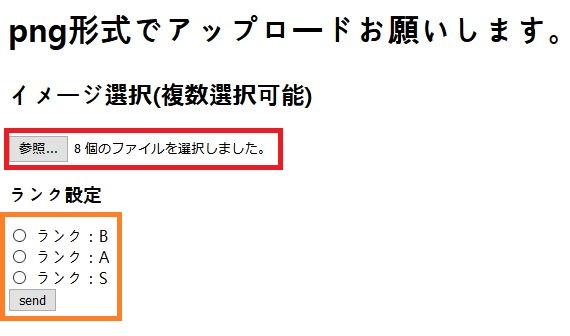
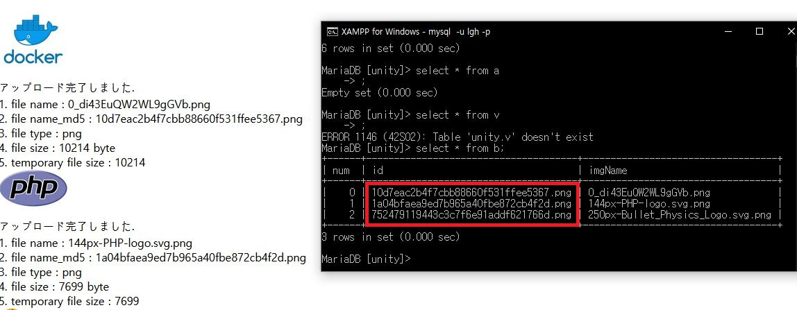
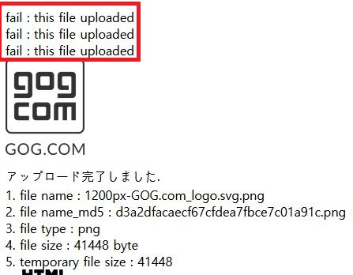

# イメージアップロードツール(概要)

## 製作理由
効率化向上のために、ゲームプランナーがガチャのデータをData Baseにアップロードを  
出来るように、ツールを製作しました。

## 実行環境
* Windows10
* XAMPP v3.2.4(Apache, MySQL)
* Chrome v89.0.4389.114
* Firefox v87.0

## 使用ツール
* Visual Studio Code

## 使用言語
* PHP 7.4.15
* HTML5

## 製作期間
4月6日(火)~4月9日(金)

## 製作人数
個人

## 製作者
LEE GEONHWI(イゴンヒ)

## 動画(YouTube)
[https://youtu.be/f2tdzeMfCnM](https://youtu.be/f2tdzeMfCnM)


# Tree
```
─Upload-Tool
    │  DB_Init.php
    │  img_Upload.php
    │  README.md
    │  Tool.php
    │
    └─doc
```

<div style="page-break-after: always; visibility: hidden"> </div>

# DB_Init.php説明書
``` consle
php DB_Init.php DB_user DB_password DB_name Table_name
```
* イメージアップロード先を生成します。


# 実行画面(web browser画面)

## Main View(Tool.php)


### 操作説明
1. 参照ボタンをクリックしてPNGファイル選択(復習選択可能)
2. ランク選択してSendボタンをクリック

## Result View(img_Upload.php)


* アップロード成功、失敗の結果が表示されます。
* ターミナル画面のData Baseに登録されています。
* アップロードされたデータの名前は暗号化して登録(**赤いボックス**)

<div style="page-break-after: always; visibility: hidden"> </div>

## アップロード重複防止


* ファイルが重複された場合、fail : this file uploadedが表示されます。

# ソースコード(Tool.php)
```html
<body>
    <h1> png形式でアップロードお願いします。 </h1>
    <h2> イメージ選択(複数選択可能) </h2>
    <form method="post" action="img_Upload.php" enctype="multipart/form-data">
        <input type="file" name="upload[]" multiple>

        <h3>ランク設定</h3>
        <input type="radio" id ="B" name="Rank" value="B">
        <label for="B"> ランク：B </label><br>
        <input type="radio" id ="A" name="Rank" value="A">
        <label for="A"> ランク：A </label><br>
        <input type="radio" id ="S" name="Rank" value="S">
        <label for="S"> ランク：S </label><br>

        <input type="submit" value="send"><br>
    </form>
</body>
```

<div style="page-break-after: always; visibility: hidden"> </div>

# ソースコード(img_Upload.php)

```php
    $dir = "uploads/"; //保存される位置

    //ファイルの名前は人が特定できないように暗号化する。
    $File_Name_MD5 = md5(microtime() . '.' . $_FILES['upload']['name'][$i]). "." .$imageType;
```

## エラー処理

```php
//形式をPNGのみ制限
  if($imageType != "png"){
        echo "Error　{$TargetFile} : please image type is png <br />";
        continue;
    }
//サーズは500KB以下に制限
    if($_FILES['upload']['size'][$i] > 500000){
        echo "{$TargetFile} : this image in too large <br />";
        continue;
    }
//============================
//中略
//============================

//サーバーに重複するファイルをチェック
    if(isset($row["id"])){
        if(file_exists($dir. $row["id"])){
            echo "fail : this file uploaded <br />";
            continue;
        }
    }
```

<div style="page-break-after: always; visibility: hidden"> </div>

## アップロード処理

```php
$upload_Success =  move_uploaded_file($_FILES['upload']['tmp_name'][$i],$uploadPath);
        
    if(!$upload_Success){
        echo "アップロード失敗しました。<br />";
        echo  $_FILES['upload']['error'][$i];
        continue;
    }

    $sql = "SELECT * FROM " . $Rank;
    $result = $conn->query($sql);
    $Row_count = $result->num_rows;
        
    $sql = "INSERT INTO $Rank (num, id, imgName)
            VALUES ('$Row_count', '$File_Name_MD5', '$TargetFile')";

    if($conn->query($sql) !== TRUE){
        echo "DB Upload fail : " . $conn->error . "<br>";
        continue;
    }
```
* アップロードが成功したら、イメージ情報をData Baseに登録する