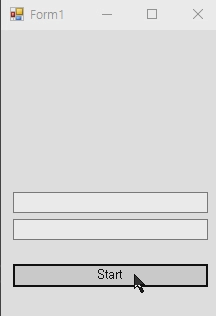

# DataBaseからイメージを取得する。プログラム

## 製作理由
ツール開発に興味があって、それを研究の為に、製作しました。

## 実行環境
* Windows 10

## 使用ツール
* Visual Studio 2019

## 使用言語
* C#

## 製作期間
* 2021年4月8日(木)~2021年4月10日(土)

## 動画(YouTube)
[https://www.youtube.com/watch?v=AXCVxSYtJSU](https://www.youtube.com/watch?v=AXCVxSYtJSU)

## 製作人数
* 個人

## 製作者
* LEE GEONHWI(イゴンヒ)

<div style="page-break-before:always"></div> 


# 実行画面(Gif)
<center></center>

# ソースコード(Form1.cs)

## Button Click Event
```csharp
    private void button1_Click(object sender, EventArgs e)
    {
        string url = "http://localhost/Gachar.php";
        var JsonObject = GetJsonData(url);

        url = "http://localhost/" + JsonObject.id;

        textBox1.Text = "Card Rank : " + JsonObject.Rank;
        pictureBox1.Image = GetImage(url);
        pictureBox1.SizeMode = PictureBoxSizeMode.StretchImage;
    }
```

<div style="page-break-before:always"></div> 

## イメージ情報を取得
```csharp
    private Person GetJsonData(string url)
    {
        try
        {
            var request = WebRequest.Create(url);
            request.Method = "GET";

            var webResponse = request.GetResponse();
            var webStream = webResponse.GetResponseStream();

            var reader = new StreamReader(webStream);

            var data = reader.ReadToEnd();

            var JsonObject = JsonSerializer.Deserialize<Person>(data);

            return JsonObject;
        }
        catch (Exception e)
        {
            Console.WriteLine(e.Message);
            return null;
        }
    }
```

## イメージ表示
```csharp
    private Image GetImage(string url)
    {
        using (WebClient client = new WebClient())
        {
            byte[] imgArray;
            imgArray = client.DownloadData(url);

            using (MemoryStream memstr = new MemoryStream(imgArray))
            {
                Image img = Image.FromStream(memstr);
                return img;
            }
        }
    }
```